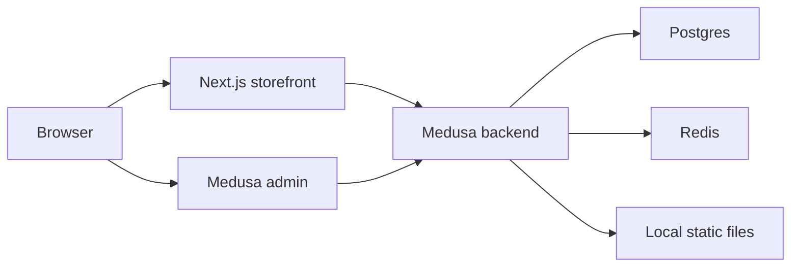

# Ayden Medusa Store

Medusa v2 backend plus a Next.js storefront, packaged as a small monorepo for local Docker development and portable deployment.

## Architecture



## Local Environment

Use the app-specific templates as the source of truth:

```sh
cp apps/backend/.env.template apps/backend/.env
cp apps/storefront/.env.template apps/storefront/.env
```

Local backend/admin defaults:

```env
PUBLIC_BACKEND_URL=http://192.168.86.176:9000
MEDUSA_BACKEND_URL=http://192.168.86.176:9000
MEDUSA_ADMIN_BACKEND_URL=http://192.168.86.176:9000
STORE_CORS=http://192.168.86.176:8000,http://localhost:8000,http://127.0.0.1:8000
ADMIN_CORS=http://192.168.86.176:9000,http://192.168.86.176:5173,http://localhost:9000,http://localhost:5173,http://127.0.0.1:9000,http://127.0.0.1:5173
AUTH_CORS=http://192.168.86.176:9000,http://192.168.86.176:5173,http://localhost:9000,http://localhost:5173,http://127.0.0.1:9000,http://127.0.0.1:5173
COOKIE_SECURE=false
COOKIE_SAME_SITE=lax
```

Local storefront defaults:

```env
NEXT_PUBLIC_MEDUSA_BACKEND_URL=http://192.168.86.176:9000
MEDUSA_BACKEND_URL=http://192.168.86.176:9000
NEXT_PUBLIC_BASE_URL=http://192.168.86.176:8000
NEXT_PUBLIC_DEFAULT_REGION=ca
```

Do not put real secrets in committed templates. Real values belong only in ignored `.env` files.

## Docker Usage

Production-style local stack:

```sh
docker compose up -d --build
```

Development with live reload:

```sh
docker compose -f docker-compose.yaml -f docker-compose.dev.yaml --profile dev up --build
```

Expected local access:

- Backend/Admin: `http://192.168.86.176:9000/app`
- Storefront: `http://192.168.86.176:8000`

Production compose uses built images and does not bind-mount source. The backend image builds the Medusa backend/admin with `pnpm --filter @dtc/backend build` and starts with `pnpm start` from `/server/apps/backend`. The storefront image builds only the storefront and starts with `pnpm start` from `/server/apps/storefront`.

## Core Commands

```sh
pnpm install --frozen-lockfile
pnpm --filter @dtc/backend build
pnpm --filter @dtc/storefront build
pnpm --filter @dtc/backend predeploy
pnpm --filter @dtc/backend seed
pnpm --filter @dtc/backend email:test
```

## PayPal

The backend registers a custom PayPal payment provider when backend credentials are present, and the storefront includes PayPal checkout UI.

Backend env:

```env
PAYPAL_CLIENT_ID=
PAYPAL_CLIENT_SECRET=
PAYPAL_WEBHOOK_ID=
PAYPAL_API_BASE_URL=
PAYPAL_ENVIRONMENT=sandbox
PAYPAL_AUTO_CAPTURE=false
```

Storefront env:

```env
NEXT_PUBLIC_PAYPAL_CLIENT_ID=
```

After Docker starts, open Medusa Admin and enable PayPal for the checkout regions that should offer it.

## Gmail / SMTP Email

Email is wired through Medusa's Notification Module. The Gmail SMTP provider is registered for the `email` channel when `EMAIL_PROVIDER=gmail`, and password reset/contact flows use the custom email service.

Backend env:

```env
EMAIL_PROVIDER=local
SMTP_HOST=
SMTP_PORT=
SMTP_SECURE=false
SMTP_USER=
SMTP_PASS=
SMTP_FROM=
SITE_PUBLIC_URL=http://192.168.86.176:8000
ADMIN_PUBLIC_URL=http://192.168.86.176:9000
CONTACT_TO_EMAIL=
EMAIL_ENABLED=false
```

Set `EMAIL_PROVIDER=gmail` and `EMAIL_ENABLED=true` only after the SMTP values are configured locally.

## Image URLs

`PUBLIC_BACKEND_URL` is used by the local file provider for uploaded assets. If existing product images were saved with an old origin, run:

```sh
pnpm fix-image-urls
```

## Validation

Useful Docker checks:

```sh
docker compose config
docker compose build --no-cache
docker compose up
docker compose ps
docker logs medusa_backend --tail=150
docker logs medusa_storefront --tail=150
docker exec -it medusa_backend sh -lc 'pwd && node -p "process.cwd()" && ls -la .medusa/server/public/admin/index.html'
docker inspect medusa_backend --format '{{json .Mounts}}'
```

The Medusa backend should not have a production bind mount to `/server` or `/app`.
